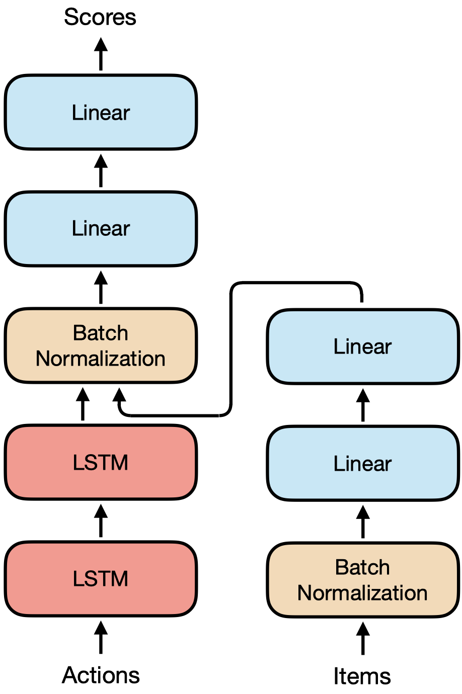
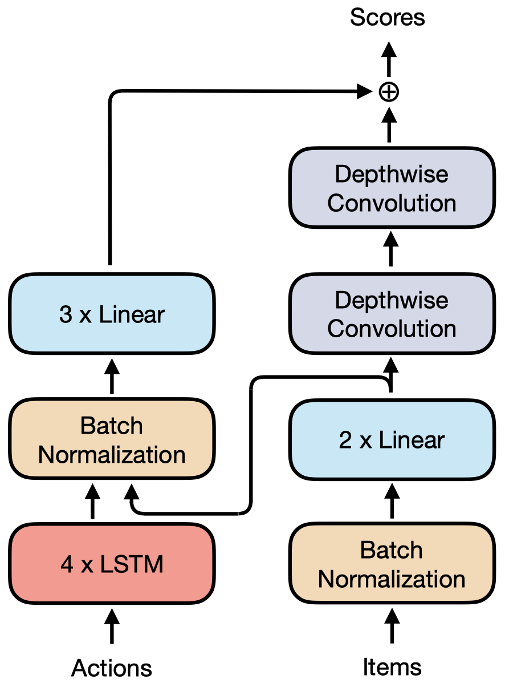
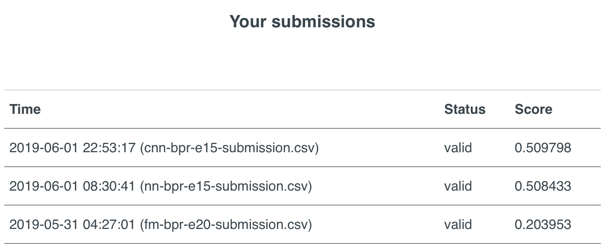

# RecSys2019 Experiments

## Introduction

These are the codes written for the experiments on the RecSys 2019 challenge **Trivago user interaction dataset**. Each ipython notebook file contains code for data preprocessing, model definition, loss definition, training, and inference.

## 1-A. Factorization Machine

A variant of the factorization machine is implemented and trained. Results are barely better than the given baseline algorithm.

## 1-B. Neural Network

## 1-C. Custom Neural Network

The submission results of the methods above are as follows:

## 2. Platform-based Feature Extraction

A small study to find out the accommodation features each country especially prefer.
